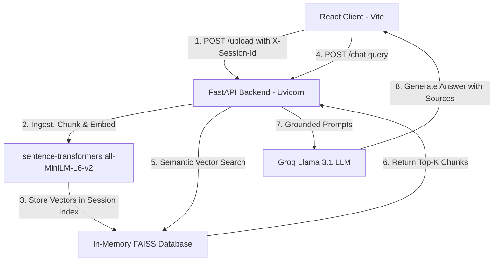

# 🔍 Enterprise-Grade Multi-Session RAG Document Assistant 📄⚡

A production-ready **Retrieval-Augmented Generation (RAG)** pipeline allowing users to upload text-heavy documents and query them using natural language. Built with a decoupled **FastAPI** backend and **React** (Vite) frontend, the system maintains isolated in-memory vector spaces for each user session using **FAISS** and **Sentence-Transformers** embeddings.

---

## 🔗 Live Submission Links

* **Live Hosted Frontend (Vercel):** [https://rag-document-assistant.vercel.app](https://rag-document-assistant.vercel.app)
* **GitHub Repository:** [https://github.com/VimalN2005/RAG-DOCUMENT-ASSITANCE](https://github.com/VimalN2005/RAG-DOCUMENT-ASSITANCE)

---

## 🛠️ System Architecture

The application leverages stateless APIs and session-specific, in-memory FAISS indices to manage user data securely:



---

## 🌟 Core Features

### 1. Isolated Session-Based Vector Spaces
* Utilizes a custom `SessionManager` running a daemon cleanup thread to maintain secure, memory-isolated FAISS indices per user session.
* Automatically wipes data after 30 minutes of inactivity or a 2-hour session lifetime cap.

### 2. Multi-Format Text Processing
* Integrates LangChain parsers (`PyPDFLoader`, `TextLoader`, `Docx2txtLoader`) to extract content from PDF, TXT, and DOCX files.
* Applies a `RecursiveCharacterTextSplitter` chunking strategy with a token size of 512 and overlap of 64.

### 3. Free, Blazing-Fast LLM Inference
* Performs semantic vector encoding using `all-MiniLM-L6-v2` locally on the CPU.
* Queries Groq's `llama-3.1-8b-instant` model for rapid, zero-cost, grounded answers.

### 4. Dockerized Configuration
* Provides a multi-container Docker Compose configuration to spin up the API and Client with a single command.

---

## 🛠️ Tech Stack

| Layer | Technology |
|---|---|
| **Frontend UI** | React 18 (Vite, Axios, Tailwind CSS) |
| **Backend API** | FastAPI (Python Uvicorn) |
| **Vector DB** | FAISS Flat-L2 (In-memory) |
| **Embeddings Model** | sentence-transformers/all-MiniLM-L6-v2 |
| **Document Loaders** | LangChain (Community Loaders) |
| **LLM Inference** | Groq Cloud API (Llama 3.1 8B) |
| **Deployment** | Docker & Docker Compose |

---

## 📁 Project Structure

```
rag-document-assistant/
├── backend/
│   ├── main.py              # FastAPI server & endpoints
│   ├── rag_pipeline.py      # In-memory FAISS & session management logic
│   ├── Dockerfile           # Backend container config
│   ├── requirements.txt     # Python dependencies
│   └── .env.example         # Template for Groq API keys
├── frontend/
│   ├── src/
│   │   ├── App.jsx          # React chat & upload component
│   │   └── main.jsx         # App root render
│   ├── index.html           # Document template
│   ├── package.json         # NPM script configurations
│   ├── vite.config.js       # Vite build properties
│   └── Dockerfile           # Frontend web server config
├── docker-compose.yml       # Dev and production orchestrator
├── .gitignore               # Ignored system & env files
└── README.md                # Project documentation
```

---

## 🚀 Setup & Run

### A. Manual Setup

1. **Start Backend**:
   ```bash
   cd rag-document-assistant/backend
   python -m venv venv
   source venv/bin/activate # Windows: venv\Scripts\activate
   pip install -r requirements.txt
   cp .env.example .env
   # Add your GROQ_API_KEY in .env
   python main.py
   ```

2. **Start Frontend**:
   ```bash
   cd rag-document-assistant/frontend
   npm install
   npm run dev
   ```

### B. Docker Compose Setup (Single Command)
```bash
cd rag-document-assistant
# Place GROQ_API_KEY in backend/.env
docker-compose up --build
# Access UI at http://localhost:5173
```

---

## 📝 Resume Blurb

> **RAG Document Assistant:** Architected a production-ready RAG application using FastAPI, React, and Docker. Implemented session-level isolation for vector search indexes using FAISS and Sentence-Transformers on CPU, integrating LangChain document loaders and Groq Llama 3.1 to generate grounded answers with source citations.
